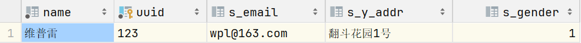

# gorm配置
> [!NOTE]
> 参考文档：[Gorm文档](https://docs.fengfengzhidao.com/#/docs/gorm%E6%96%87%E6%A1%A3/1.%E8%BF%9E%E6%8E%A5)  
> 参考教程：[Gorm教程](https://www.bilibili.com/video/BV1xg411t7RZ/)
## 下载mysql的驱动

```shell
go get gorm.io/driver/mysql
go get gorm.io/gorm
```
## 设计表结构
```go
/* 
    CREATE TABLE Students (
    ID INT AUTO_INCREMENT PRIMARY KEY,
    Name VARCHAR(255) NOT NULL,
    Email VARCHAR(255)
    );
 */
type StudentInfo struct {
    Email  *string `gorm:"size:32"` // 使用指针是为了存空值
    Addr   string  `gorm:"column:y_addr;size:16"`
    Gender bool    `gorm:"default:true"`
}
type Student struct {
    Name string      `gorm:"type:varchar(12);not null;comment:用户名"`
    UUID string      `gorm:"primaryKey;unique;comment:主键"`
    Info StudentInfo `gorm:"embedded;embeddedPrefix:s_"`
}
```
## 连接数据库
```go
func main() {
	username := "root"   //账号
	password := "135789" //密码
	host := "127.0.0.1"  //数据库地址，可以是Ip或者域名
	port := 3306         //数据库端口
	Dbname := "gorm"     //数据库名
	timeout := "10s"     //连接超时，10秒

	// root:root@tcp(127.0.0.1:3306)/gorm?
	dsn := fmt.Sprintf("%s:%s@tcp(%s:%d)/%s?charset=utf8mb4&parseTime=True&loc=Local&timeout=%s", username, password, host, port, Dbname, timeout)
	//连接MYSQL, 获得DB类型实例，用于后面的数据库读写操作。
	DB, err := gorm.Open(mysql.Open(dsn))
	if err != nil {
		panic("连接数据库失败, error=" + err.Error())
	}
	// 连接成功
	fmt.Println(DB)
	// 创建表结构
	DB.AutoMigrate(&Student{})
	/*
		1. 检查数据库中是否存在一个名为students的表（通常GORM会将结构体名转换为复数形式作为表名）。
		2. 如果表不存在，GORM会根据Student结构体的定义创建这个表。
		3. 如果表已经存在，GORM会检查表的结构是否与Student结构体的定义相匹配。
		4. 如果不匹配（例如，添加了新的字段或者改变了字段类型），GORM会更新表结构以匹配Student结构体的定义。
	*/
}
```
## 插入数据
```go
	email := "wpl@163.com"
	student := Student{
		Name: "维普雷",
		UUID: "123",
		Info: StudentInfo{
			Email:  &email,
			Addr:   "翻斗花园1号",
			Gender: true,
		},
	}
	DB.Create(&student)
```
### 表结构

### 表中信息


