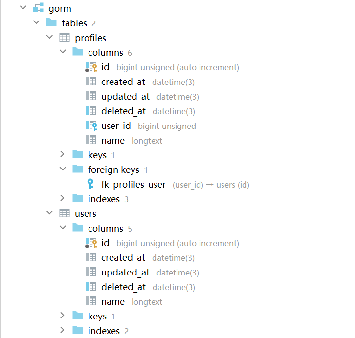
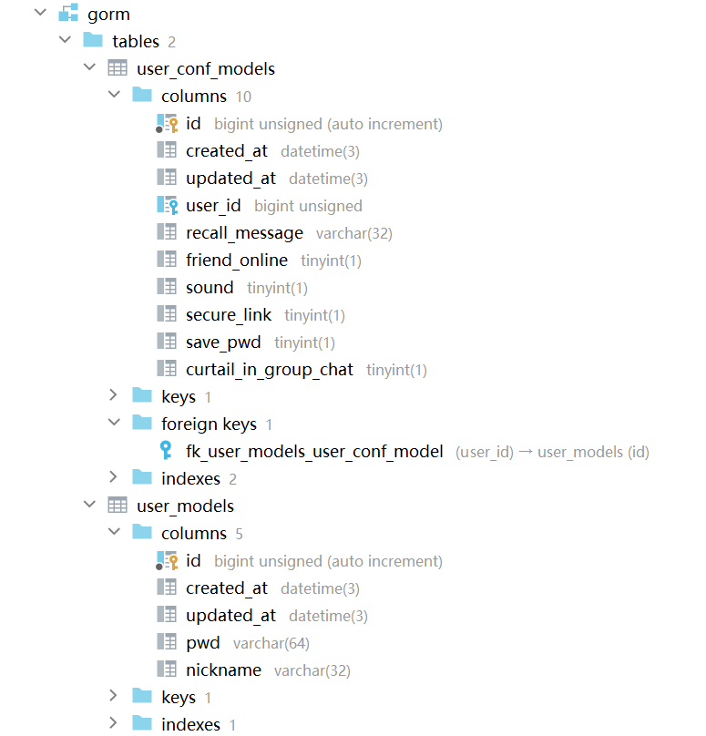

# gorm外键关联
## 建表示例
### User 和 Profile表定义
```go
package my_gorm

import "gorm.io/gorm"

type User struct {
	gorm.Model
	Name string
}

type Profile struct {
	gorm.Model
	UserID uint
	Name   string
	// 使用 gorm:"foreignKey:UserID" 来定义外键约束
	User User `gorm:"foreignKey:UserID"`
}
```
### test文件
```go
package my_gorm

import (
	"fmt"
	"gorm.io/driver/mysql"
	"gorm.io/gorm"
	"testing"
)

func TestName(t *testing.T) {
	username := "root"   //账号
	password := "135789" //密码
	host := "127.0.0.1"  //数据库地址，可以是Ip或者域名
	port := 3306         //数据库端口
	Dbname := "gorm"     //数据库名
	timeout := "10s"     //连接超时，10秒
	
	dsn := fmt.Sprintf(
		"%s:%s@tcp(%s:%d)/%s?charset=utf8mb4&parseTime=True&loc=Local&timeout=%s",
		username, password, host, port, Dbname, timeout)
	DB, err := gorm.Open(mysql.Open(dsn))
	if err != nil {
		panic("连接数据库失败, error=" + err.Error())
	}
	// 连接成功
	fmt.Println(DB)
	// 创建表结构
	DB.AutoMigrate(&User{}, &Profile{})
}
```
### 建表结果

## 用户表与用户配置表测试
###
> UserModel没有设置对应外键，所以即使定义了外键信息，也不会正确创建，结果与注释掉相同
```go
// UserModel 用户表
type UserModel struct {
	models.Model
	Pwd      string `gorm:"size:64" json:"-"`
	Nickname string `gorm:"size:32" json:"nickname"`
	//UserConfModel *UserConfModel `gorm:"foreignKey:UserID" json:"UserConfModel"`
}

// 用户配置表
type UserConfModel struct {
	models.Model
	UserID             uint      `json:"userID"`
	UserModel          UserModel `gorm:"foreignKey:UserID" json:"-"`
	RecallMessage      *string   `gorm:"size:32" json:"recallMessage"` // 撤回消息的提示内容
	FriendOnline       bool      `json:"friendOnline"`                 // 好友上线提醒
	Sound              bool      `json:"sound"`                        // 声音
	SecureLink         bool      `json:"secureLink"`                   // 安全链接
	SavePwd            bool      `json:"savePwd"`                      // 保存密码
	CurtailInGroupChat bool      `json:"curtailInGroupChat"`           // 限制加群
}
```
### 只自动迁移UserConfModel表，UserModel表也会被正确建立出来
```go
func TestName(t *testing.T) {
	username := "root"   //账号
	password := "135789" //密码
	host := "127.0.0.1"  //数据库地址，可以是Ip或者域名
	port := 3306         //数据库端口
	Dbname := "gorm"     //数据库名
	timeout := "10s"     //连接超时，10秒

	// root:root@tcp(127.0.0.1:3306)/gorm?
	dsn := fmt.Sprintf("%s:%s@tcp(%s:%d)/%s?charset=utf8mb4&parseTime=True&loc=Local&timeout=%s", username, password, host, port, Dbname, timeout)
	// 连接MYSQL, 获得DB类型实例，用于后面的数据库读写操作。
	DB, err := gorm.Open(mysql.Open(dsn))
	if err != nil {
		panic("连接数据库失败, error=" + err.Error())
	}
	// 连接成功
	fmt.Println(DB)
	// 创建表结构
	DB.AutoMigrate(&UserConfModel{})
	//DB.AutoMigrate(&UserModel{})
}
```
### 建表结果
