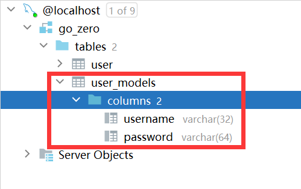

# gorm 结合 go-zero

## models编写
### 下载mysql的驱动
```shell
go get gorm.io/driver/mysql
go get gorm.io/gorm
```
### 编写commen/init_gorm/enter.go
```go
package init_gorm

import (
	"fmt"
	"gorm.io/driver/mysql"
	"gorm.io/gorm"
)

func InitGorm(MysqlDataSource string) *gorm.DB {
	db, err := gorm.Open(mysql.Open(MysqlDataSource), &gorm.Config{})
	if err != nil {
		panic("连接数据库失败，err = " + err.Error())
	} else {
		fmt.Println("连接数据库成功")
	}
	// 不要忘记建表
	err = db.AutoMigrate(&models.UserModel{})
	if err != nil {
		fmt.Println("迁移数据库模式 失败")
	} else {
		fmt.Println("迁移数据库模式 成功")
	}
	return db
}
```
## 编写api代码
```api
type LoginRequest {
	UserName string `json:"username"`
	Password string `json:"password"`
}

@server (
	prefix: /api/users
)
service users {
	@handler login
	post /login (LoginRequest) returns (string)
}

// goctl api go -api user.api -dir .
```
### 配置 users.yaml
```yaml
Mysql:
  DataSource: root:135789@tcp(127.0.0.1:3306)/go_zero?charset=utf8mb4&parseTime=True&loc=Local
```
### 修改 config.go
```go
type Config struct {
	rest.RestConf
	Mysql struct {
		DataSource string
	}
}
```
### 修改 servicecontext.go
```go
type ServiceContext struct {
	Config config.Config
	DB     *gorm.DB
}

func NewServiceContext(c config.Config) *ServiceContext {
	db := init_gorm.InitGorm(c.Mysql.DataSource)
	return &ServiceContext{
		Config: c,
		DB:     db,
	}
}
```
### 编写 loginlogic.go 
```go
func (l *LoginLogic) Login(req *types.LoginRequest) (resp string, err error) {
	// todo: add your logic here and delete this line
	var user models.UserModel
	err = l.svcCtx.DB.Take(&user, "username = ? and password = ?", req.UserName, req.Password).Error
	if err != nil {
		return "", errors.New("登录失败")
	}
	return user.Username, nil
}
```
### 用apifox测试（没有数据的话提前插入一个数据）



